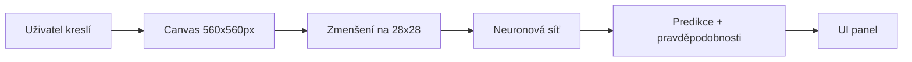
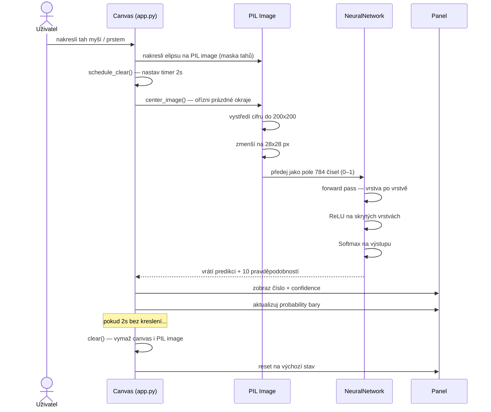
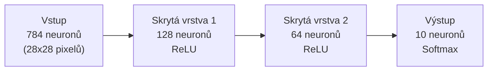
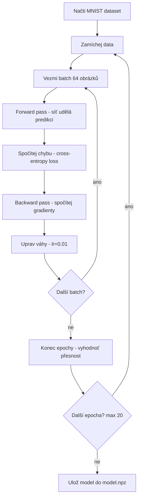
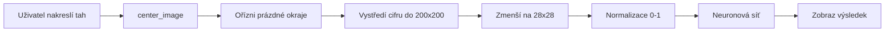
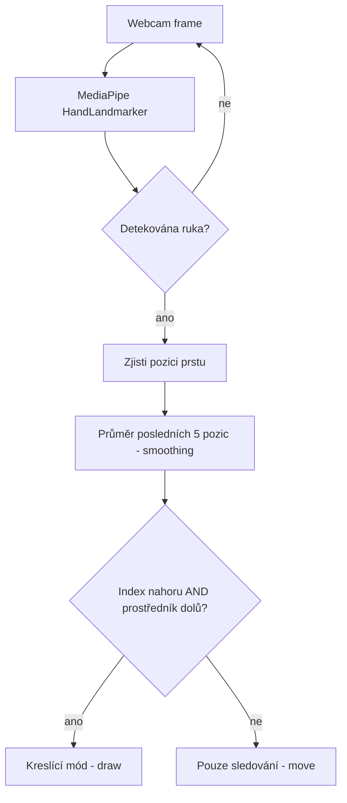

# Jak funguje SketchMind

---

## 1. Celkový přehled

Aplikace má tři hlavní části:
- **Kreslící canvas** — uživatel kreslí myší nebo prstem přes webcam
- **Neuronová síť** — dostane obrázek 28x28px a vrátí co si myslí že je na něm
- **Panel s výsledkem** — zobrazí predikci a pravděpodobnosti pro každou cifru



---

## 2. Sekvenční diagram — od tahu po výsledek



---

## 3. Neuronová síť

### Architektura



- **784 vstupů** — každý pixel obrázku 28x28 je jeden vstup (hodnota 0–1)
- **128 a 64** — skryté vrstvy, kde se učí rozpoznávat tvary a vzory
- **10 výstupů** — jeden pro každou cifru (0–9), hodnoty jsou pravděpodobnosti

### Aktivační funkce

**ReLU** (skryté vrstvy) — záporné hodnoty zahodí, kladné nechá projít:
```
f(x) = max(0, x)
```

**Softmax** (výstupní vrstva) — převede čísla na pravděpodobnosti, součet = 1:
```
f(x_i) = e^x_i / součet(e^x_j)
```

### Inicializace vah

Váhy se inicializují náhodně podle He inicializace:
```
w = náhodné číslo * sqrt(2 / počet_vstupů)
```
Bez toho by síť konvergovala velmi pomalu nebo vůbec.

---

## 4. Trénování (train.py)

### Dataset — MNIST

- 60 000 trénovacích obrázků, 10 000 testovacích
- Každý obrázek je 28x28 pixelů, černobílý
- Stahuje se automaticky při prvním spuštění

### Průběh trénování



### Loss funkce — Cross-entropy

Měří jak moc se predikce liší od správné odpovědi:
```
loss = -log(pravděpodobnost správné třídy)
```
Čím větší chyba, tím větší číslo. Cíl je dostat loss co nejníže.

### Backpropagation

Algoritmus který projde síť pozpátku a spočítá o kolik je zodpovědná každá váha za chybu.
Pak každou váhu o trochu posune správným směrem (gradient descent).

```
nová_váha = stará_váha - learning_rate * gradient
```

---

## 5. Předpověď v reálném čase (app.py)

Každý tah štětcem spustí predikci:



**Proč center_image?**
MNIST dataset má cifry vždy vystředěné. Pokud bychom poslali obrázek bez centrování, síť by ho nepoznala protože by vypadal jinak než data na kterých se učila.

---

## 6. Kamera (camera.py)



**Jak se detekuje gesto:**
- index nahoru = špička prstu výše než druhý kloub
- prostředník dolů = špička níže než druhý kloub
- oboje splněno = kreslíme

**Smoothing:**
Pozice prstu se průměruje přes posledních 5 snímků aby se eliminovalo třesení ruky.

---

## 7. Jak se zobrazuje kamera v okně

Problém: canvas je černý, ale chceme vidět kameru i nakreslené tahy zároveň.

Řešení:
```
kamera frame (RGB)
    +
maska nakreslených tahů (grayscale)
    =
výsledný obraz s bílými tahy přes kameru
```

V kódu:
```python
colored_strokes = Image.new("RGB", ..., (255, 255, 255))  # bílý obraz
img.paste(colored_strokes, mask=self.image)               # nalep přes kameru tam kde jsou tahy
```

---

## 8. Přesnost sítě

| Dataset       | Počet obrázků | Přesnost |
|---------------|---------------|----------|
| Trénovací     | 60 000        | ~99%     |
| Testovací     | 10 000        | ~97%     |

Rozdíl mezi trénovací a testovací přesností je malý — síť se nepřeučila (no overfitting).

---

## 9. Struktura souborů

```
SketchMind/
├── src/
│   ├── network.py     neuronová síť (čistý NumPy)
│   ├── train.py       trénování na MNIST
│   ├── app.py         GUI aplikace (Tkinter)
│   └── camera.py      sledování prstu (MediaPipe)
├── tests/
│   ├── test_network.py    testy sítě
│   └── test_train.py      testy načítání dat
├── docs/
│   └── jak_to_funguje.md  tento dokument
├── model/             uložené váhy (ignorováno gitem)
├── data/              MNIST soubory (ignorováno gitem)
├── requirements.txt
└── README.md
```
